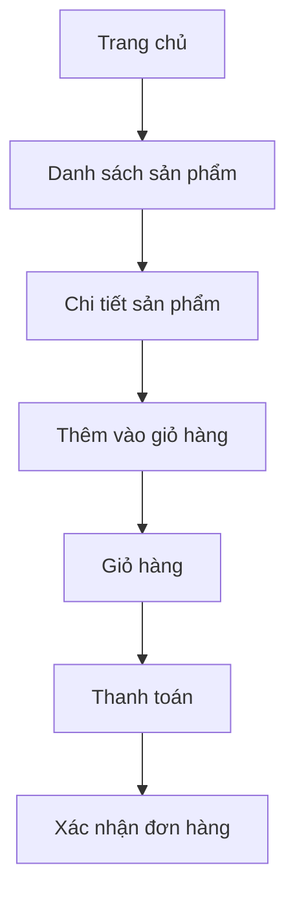

# 💻 Dự Án Website Mua Bán LapTop

## 👤 Thông Tin Sinh Viên
- **Họ và tên:** Đỗ Thanh Tùng 
- **Mã sinh viên:** 23010811  
- **Lớp:** K17_CNTT-8   
- **Môn học:** Web nâng cao (TH3)

---

## 📋 Giới Thiệu Dự Án

Dự án LaptopStore nhằm cung cấp một nền tảng trực tuyến thuận tiện cho việc mua sắm laptop. Chúng tôi muốn mang đến cho khách hàng một trải nghiệm mua sắm dễ dàng và hiệu quả với nhiều lựa chọn sản phẩm đa dạng.
| **Nội dung**              | **Chi tiết**                                                                                                                                    |
| ------------------------- | ----------------------------------------------------------------------------------------------------------------------------------------------- |
| **Tên dự án**             | **LaptopStore**                                                                                                                                 |
| **Mục tiêu**              | Cung cấp nền tảng thương mại điện tử chuyên bán laptop                                                                                          |
| **Tầm nhìn**              | Trở thành kênh mua sắm laptop trực tuyến uy tín và tiện lợi hàng đầu                                                                            |
| **Đối tượng sử dụng**     | - Khách hàng có nhu cầu mua laptop<br>- Quản trị viên hệ thống                                                                                  |
| **Tính năng chính**       | - Hiển thị danh sách sản phẩm<br>- Giỏ hàng, đặt hàng, thanh toán<br>- Quản lý sản phẩm, đơn hàng, người dùng<br>- Thống kê doanh thu           |
| **Công nghệ sử dụng**     | - Backend: Laravel 10 (API RESTful)<br>- Frontend: Blade / Bootstrap<br>- DB: MySQL 8.x<br>- Queue: Redis<br>- Xác thực: Laravel Sanctum        |
| **Điểm nổi bật**          | - Giao diện đơn giản, dễ sử dụng<br>- Hệ thống phân quyền rõ ràng<br>- Dữ liệu bảo mật, xác thực mạnh<br>- Có thể mở rộng thành SPA hoặc mobile |
| **Định hướng phát triển** | - Tích hợp thanh toán online (VNPay, Momo)<br>- Tích hợp gợi ý sản phẩm<br>- Phát triển ứng dụng di động hoặc SPA frontend                      |


## 📌 Mục Tiêu

Xây dựng hệ thống **bán máy tính online** với các tính năng chính:

| **Chức năng**           | **Mô tả**                                                              | **Vai trò sử dụng**       |
| ----------------------- | ---------------------------------------------------------------------- | ------------------------- |
| **Trang chủ**           | Hiển thị danh sách sản phẩm, thông tin cơ bản như giá, ảnh, khuyến mãi | Tất cả người dùng         |
| **Chi tiết sản phẩm**   | Xem chi tiết từng sản phẩm, thông số kỹ thuật, hình ảnh, đánh giá      | Tất cả người dùng         |
| **Giỏ hàng**            | Cho phép thêm, sửa, xoá sản phẩm trong giỏ                             | Khách hàng                |
| **Đặt hàng**            | Giao diện xác nhận đơn hàng, nhập thông tin giao hàng, mã giảm giá     | Khách hàng                |
| **Thanh toán online**   | Tích hợp thanh toán qua ví điện tử hoặc ngân hàng (tùy cấu hình)       | Khách hàng                |
| **Quản lý đơn hàng**    | Xem lịch sử đơn, trạng thái đơn, chi tiết từng đơn                     | Khách hàng, Quản trị viên |
| **Đăng nhập / Đăng ký** | Xác thực người dùng qua email và mật khẩu                              | Tất cả người dùng         |
| **Quản lý người dùng**  | Phân quyền `admin` / `customer`, quản lý thông tin, đổi mật khẩu       | Quản trị viên             |
| **Quản lý sản phẩm**    | Tạo, sửa, xoá sản phẩm, upload ảnh, gán danh mục                       | Quản trị viên             |
| **Quản lý danh mục**    | Tạo, sửa, xoá danh mục sản phẩm                                        | Quản trị viên             |
| **Thống kê doanh thu**  | Biểu đồ doanh thu theo ngày, tháng, sản phẩm bán chạy                  | Quản trị viên             |
| **Hệ thống phân quyền** | Middleware kiểm tra vai trò khi gọi các route API                      | Tất cả người dùng         |


---

## 🧱 Công Nghệ Sử Dụng

| Thành phần          | Công nghệ                           |
| ------------------- | ----------------------------------- |
| Backend API         | Laravel 10 (RESTful API)            |
| Frontend            | Blade Template / Bootstrap / jQuery |
| Database            | MySQL 8.x                           |
| Queue xử lý nền     | Redis + Laravel Queue               |
| Xác thực người dùng | Laravel Sanctum                     |
| Triển khai          | Docker, Nginx                       |


---

## 🔄 Luồng Người Dùng


```mermaid
graph TD
    A[Trang chủ] --> B[Danh sách sản phẩm]
    B --> C[Chi tiết sản phẩm]
    C --> D[Thêm vào giỏ hàng]
    D --> E[Giỏ hàng]
    E --> F[Thanh toán]
    F --> G[Xác nhận đơn hàng]
```

---

## 🛠️ Kiến Trúc Thư Mục Laravel (rút gọn)

```bash
app/
├── Http/
│   ├── Controllers/
│   │   ├── ProductController.php
│   │   ├── CartController.php
│   │   └── OrderController.php
├── Models/
│   ├── Product.php
│   ├── Order.php
│   └── User.php
routes/
├── web.php
├── api.php
resources/views/
├── layouts/
├── home.blade.php
├── product.blade.php
├── cart.blade.php
```

---

## 📷 GIAO DIỆN NGƯỜI DÙNG CHI TIẾT

### Trang Chủ

| Thành phần        | Mô tả                                                                    | Hành vi & Tương tác                                                              |
| ----------------- | ------------------------------------------------------------------------ | -------------------------------------------------------------------------------- |
| Header            | Logo, menu chính, ô tìm kiếm, nút đăng nhập/đăng ký, biểu tượng giỏ hàng | - Click logo quay về trang chủ<br>- Click giỏ hàng chuyển tới trang giỏ hàng     |
| Banner quảng cáo  | Hình ảnh lớn quảng bá sản phẩm, khuyến mãi hoặc chương trình giảm giá    | - Tự động chuyển ảnh sau vài giây<br>- Có thể click để chuyển đến trang sản phẩm |
| Danh mục sản phẩm | Hiển thị các danh mục chính: Laptop, PC, Màn hình, Phụ kiện,...          | - Hover để hiển thị sub-menu (nếu có)<br>- Click để vào trang danh sách sản phẩm |
| Sản phẩm nổi bật  | Dạng lưới các sản phẩm hot: ảnh, tên, giá, nút "Mua ngay"                | - Click tên hoặc ảnh để xem chi tiết<br>- Click "Mua ngay" thêm vào giỏ hàng     |
| Tin tức mới nhất  | Các bài viết blog liên quan đến công nghệ, thủ thuật, tin sản phẩm mới   | - Click tiêu đề để xem toàn bộ bài viết                                          |
| Footer            | Thông tin liên hệ, chính sách bảo mật, điều khoản sử dụng, liên kết MXH  | - Có thể click liên kết để mở trang ngoài                                        |

---

### Danh Sách Sản Phẩm

| Thành phần       | Mô tả                                                              | Hành vi & Tương tác                                                     |
| ---------------- | ------------------------------------------------------------------ | ----------------------------------------------------------------------- |
| Tiêu đề danh mục | Hiển thị tên danh mục đang được xem                                | - Tự động thay đổi theo danh mục khi chuyển trang                       |
| Bộ lọc sản phẩm  | Cho phép lọc theo giá, thương hiệu, loại sản phẩm, đánh giá        | - Lọc theo checkbox, range giá, dropdown…                               |
| Sắp xếp          | Tuỳ chọn sắp xếp theo giá tăng/dảm, tên, sản phẩm mới nhất         | - Chọn từ dropdown để sắp xếp                                           |
| Lưới sản phẩm    | Hiển thị sản phẩm: ảnh, tên, giá, trạng thái kho, nút xem chi tiết | - Click ảnh hoặc tên để xem chi tiết                                    |
| Phân trang       | Hiển thị số trang hiện tại, chuyển qua lại giữa các trang          | - Click số trang để chuyển<br>- Click nút next/prev để điều hướng trang |

---

### Chi Tiết Sản Phẩm

| Thành phần             | Mô tả                                                     | Hành vi & Tương tác                                           |
| ---------------------- | --------------------------------------------------------- | ------------------------------------------------------------- |
| Ảnh sản phẩm chính     | Ảnh to của sản phẩm                                       | - Click để phóng to<br>- Hover để xem chi tiết                |
| Bộ ảnh phụ             | Gallery nhỏ bên dưới sản phẩm chính                       | - Click ảnh nhỏ để thay đổi ảnh lớn                           |
| Thông tin cơ bản       | Tên sản phẩm, giá tiền, trạng thái kho, thương hiệu       | - Tự động hiển thị khi chọn biến thể (nếu có)                 |
| Thông số kỹ thuật      | CPU, RAM, Ổ cứng, VGA, Màn hình,…                         | - Trình bày dạng bảng                                         |
| Mô tả chi tiết         | Đoạn văn mô tả chi tiết về tính năng, hiệu năng, bảo hành | - Hiển thị đầy đủ, có thể collapsible                         |
| Số lượng + nút mua     | Ô nhập số lượng và nút "Thêm vào giỏ"                     | - Chọn số lượng rồi thêm vào giỏ hàng                         |
| Sản phẩm liên quan     | Gợi ý sản phẩm cùng danh mục                              | - Click để chuyển sang sản phẩm khác                          |
| Đánh giá từ người dùng | Danh sách các đánh giá + hệ thống đánh giá 5 sao          | - Người dùng đã mua có thể đánh giá, hiển thị điểm trung bình |

---

### Trang Giỏ Hàng

| Thành phần               | Mô tả                                                 | Hành vi & Tương tác                                          |
| ------------------------ | ----------------------------------------------------- | ------------------------------------------------------------ |
| Bảng sản phẩm            | Gồm: ảnh, tên, đơn giá, số lượng, thành tiền, nút xoá | - Cho phép cập nhật số lượng<br>- Xoá sản phẩm khỏi giỏ hàng |
| Tính tổng                | Tính tổng thành tiền của các sản phẩm                 | - Tự động cập nhật khi thay đổi số lượng hoặc xoá            |
| Nhập mã giảm giá         | Ô nhập coupon, voucher giảm giá                       | - Kiểm tra mã hợp lệ và trừ tiền nếu đúng                    |
| Ghi chú đơn hàng         | Cho phép ghi chú thêm cho đơn                         | - Lưu ghi chú kèm đơn hàng                                   |
| Nút tiến hành thanh toán | Chuyển sang bước xác nhận và thanh toán đơn hàng      | - Phải đăng nhập mới có thể tiếp tục                         |

---

### Trang Thanh Toán

| Thành phần              | Mô tả                                                     | Hành vi & Tương tác                                                                |
| ----------------------- | --------------------------------------------------------- | ---------------------------------------------------------------------------------- |
| Thông tin người nhận    | Họ tên, số điện thoại, email, địa chỉ giao hàng           | - Nhập hoặc chọn từ danh sách địa chỉ đã lưu                                       |
| Phương thức thanh toán  | COD, Chuyển khoản, Ví điện tử,...                         | - Chọn 1 phương thức, có thể hiển thị nội dung tương ứng                           |
| Tóm tắt giỏ hàng        | Hiển thị lại các sản phẩm trong đơn hàng, số lượng và giá | - Không cho chỉnh sửa, chỉ xem lại                                                 |
| Phí giao hàng           | Tính phí vận chuyển theo khu vực                          | - Tự động tính hoặc chọn đơn vị vận chuyển khác                                    |
| Ghi chú đơn hàng        | Trường nhập ghi chú thêm nếu có                           | - Không bắt buộc                                                                   |
| Nút xác nhận & đặt hàng | Nút gửi yêu cầu tạo đơn hàng                              | - Kiểm tra hợp lệ toàn bộ thông tin<br>- Sau đó chuyển hướng sang trang thành công |

---

### Trang Đơn Hàng Đã Mua

| Thành phần         | Mô tả                                                                   | Hành vi & Tương tác                                                                      |
| ------------------ | ----------------------------------------------------------------------- | ---------------------------------------------------------------------------------------- |
| Danh sách đơn hàng | Hiển thị danh sách các đơn hàng đã đặt                                  | - Có phân trang nếu nhiều<br>- Mỗi dòng hiển thị mã đơn, ngày đặt, trạng thái, tổng tiền |
| Chi tiết đơn hàng  | Khi click vào từng đơn, hiển thị chi tiết sản phẩm, địa chỉ, thanh toán | - Có thể in hóa đơn<br>- Xem lịch sử trạng thái đơn (Pending → Đang giao → Hoàn tất)     |
| Hủy đơn hàng       | Cho phép hủy đơn nếu đơn chưa xử lý/giao                                | - Yêu cầu xác nhận khi hủy                                                               |
| Gửi đánh giá       | Với mỗi sản phẩm đã mua, có thể đánh giá và để lại nhận xét             | - Đánh giá theo hệ thống sao (⭐) và nội dung nhận xét                                   |

---

### Trang Quản Lý Tài Khoản Khách Hàng

| Thành phần        | Mô tả                                                       | Hành vi & Tương tác                                                   |
| ----------------- | ----------------------------------------------------------- | --------------------------------------------------------------------- |
| Thông tin cá nhân | Tên, email, số điện thoại, ngày sinh,…                      | - Có thể chỉnh sửa và lưu lại thông tin                               |
| Đổi mật khẩu      | Nhập mật khẩu hiện tại + mật khẩu mới                       | - Kiểm tra đúng mật khẩu hiện tại mới cho phép đổi                    |
| Danh sách địa chỉ | Quản lý nhiều địa chỉ giao hàng (thêm/sửa/xoá)              | - Có thể đặt 1 địa chỉ mặc định                                       |
| Lịch sử mua hàng  | Liệt kê các đơn đã đặt (rút gọn từ "Trang đơn hàng đã mua") | - Có thể click để xem chi tiết                                        |
| Đăng xuất         | Thoát khỏi phiên đăng nhập hiện tại                         | - Thực hiện logout, xoá token, điều hướng về trang chủ hoặc đăng nhập |
|                   |

---

## 🔐 Xác Thực & Phân Quyền

-   **Role:** `customer` và `admin`
-   **Middleware:** Phân quyền theo route

```php
Route::middleware('auth:sanctum')->group(function () {
    Route::get('/orders', [OrderController::class, 'index']);
    Route::middleware('admin')->group(function () {
        Route::resource('/products', ProductController::class);
    });
});
```

---

## 🧮 Mô Hình Dữ Liệu

### Bảng `users`

| Tên cột    | Kiểu dữ liệu  | Mô tả                      |
| ---------- | ------------- | -------------------------- |
| id         | BIGINT (auto) | Khoá chính                 |
| name       | VARCHAR(100)  | Tên người dùng             |
| email      | VARCHAR(255)  | Email đăng nhập (duy nhất) |
| password   | VARCHAR(255)  | Mật khẩu đã mã hoá         |
| role       | ENUM          | `admin` hoặc `customer`    |
| phone      | VARCHAR(15)   | Số điện thoại              |
| address    | TEXT          | Địa chỉ người dùng         |
| created_at | TIMESTAMP     | Ngày tạo                   |
| updated_at | TIMESTAMP     | Ngày cập nhật              |

---

### Bảng `products`

| Tên cột     | Kiểu dữ liệu   | Mô tả                           |
| ----------- | -------------- | ------------------------------- |
| id          | BIGINT (auto)  | Khoá chính                      |
| name        | VARCHAR(255)   | Tên sản phẩm                    |
| description | TEXT           | Mô tả chi tiết sản phẩm         |
| price       | DECIMAL(12, 0) | Giá sản phẩm                    |
| thumbnail   | VARCHAR(255)   | Đường dẫn ảnh đại diện sản phẩm |
| category_id | BIGINT         | Liên kết tới bảng `categories`  |
| quantity    | INTEGER        | Số lượng tồn kho                |
| created_at  | TIMESTAMP      | Ngày tạo sản phẩm               |
| updated_at  | TIMESTAMP      | Ngày cập nhật sản phẩm          |

---

### Bảng `categories`

| Tên cột    | Kiểu dữ liệu  | Mô tả              |
| ---------- | ------------- | ------------------ |
| id         | BIGINT (auto) | Khoá chính         |
| name       | VARCHAR(100)  | Tên danh mục       |
| slug       | VARCHAR(100)  | URL thân thiện SEO |
| created_at | TIMESTAMP     | Ngày tạo           |
| updated_at | TIMESTAMP     | Ngày cập nhật      |

---

### Bảng `carts`

| Tên cột    | Kiểu dữ liệu  | Mô tả                      |
| ---------- | ------------- | -------------------------- |
| id         | BIGINT (auto) | Khoá chính                 |
| user_id    | BIGINT        | Người dùng sở hữu giỏ hàng |
| product_id | BIGINT        | Sản phẩm trong giỏ         |
| quantity   | INTEGER       | Số lượng                   |
| created_at | TIMESTAMP     | Ngày thêm                  |
| updated_at | TIMESTAMP     | Ngày cập nhật              |

---

### Bảng `order_items`

| Tên cột    | Kiểu dữ liệu   | Mô tả                          |
| ---------- | -------------- | ------------------------------ |
| id         | BIGINT (auto)  | Khoá chính                     |
| order_id   | BIGINT         | Gắn với đơn hàng               |
| product_id | BIGINT         | Sản phẩm được mua              |
| quantity   | INTEGER        | Số lượng                       |
| price      | DECIMAL(12, 0) | Giá lúc mua                    |
| total      | DECIMAL(12, 0) | Thành tiền = quantity \* price |

---

### Bảng `coupons`

| Tên cột     | Kiểu dữ liệu  | Mô tả                               |
| ----------- | ------------- | ----------------------------------- |
| id          | BIGINT (auto) | Khoá chính                          |
| code        | VARCHAR(50)   | Mã giảm giá                         |
| discount    | DECIMAL(5, 2) | Giảm phần trăm hoặc số tiền cố định |
| type        | ENUM          | `percent`, `fixed`                  |
| expired_at  | TIMESTAMP     | Ngày hết hạn                        |
| usage_limit | INTEGER       | Giới hạn số lần sử dụng             |
| used        | INTEGER       | Đã sử dụng bao nhiêu lần            |

---

### Bảng `contacts`

| Tên cột    | Kiểu dữ liệu  | Mô tả            |
| ---------- | ------------- | ---------------- |
| id         | BIGINT (auto) | Khoá chính       |
| name       | VARCHAR(100)  | Tên người gửi    |
| email      | VARCHAR(100)  | Email liên hệ    |
| message    | TEXT          | Nội dung liên hệ |
| created_at | TIMESTAMP     | Ngày gửi         |

---

## 🚀 Một Số API Tiêu Biểu

### 🟢 Đăng nhập

```http
POST /api/login
Content-Type: application/json

{
    "email": "john@gmail.com",
    "password": "password"
}
```

---

### 🟢 Lấy danh sách sản phẩm

```http
GET /api/products
Authorization: Bearer {token}
```

---

### 🟢 Đặt hàng

```http
POST /api/orders
Authorization: Bearer {token}

{
    "products": [
        {"id": 1, "quantity": 2}
    ]
}
```

## 🧑‍💼 Luồng Admin

### Dashboard

| Thành phần        | Mô tả                                                              | Hành vi & Tương tác                                 |
| ----------------- | ------------------------------------------------------------------ | --------------------------------------------------- |
| Tổng quan         | Số lượng sản phẩm, đơn hàng, người dùng, doanh thu                 | - Tự động cập nhật dữ liệu theo thời gian thực      |
| Đơn hàng gần nhất | Danh sách đơn hàng mới nhất (mã, tên khách, tổng tiền, trạng thái) | - Click vào mã đơn để chuyển sang chi tiết đơn hàng |
| Biểu đồ doanh thu | Biểu đồ cột hoặc đường theo ngày/tháng                             | - Có thể chọn khoảng thời gian để lọc               |
| Sản phẩm bán chạy | Danh sách top sản phẩm theo doanh số                               | - Click vào sản phẩm để chỉnh sửa hoặc xem chi tiết |

---

### Quản Lý Sản Phẩm

| Thành phần             | Mô tả                                                             | Hành vi & Tương tác                                      |
| ---------------------- | ----------------------------------------------------------------- | -------------------------------------------------------- |
| Danh sách sản phẩm     | Hiển thị bảng gồm tên, ảnh, giá, danh mục, trạng thái             | - Có thể chỉnh sửa, xoá, tìm kiếm, lọc theo danh mục     |
| Form thêm/sửa sản phẩm | Gồm: tên, ảnh, mô tả, giá, tồn kho, danh mục, trạng thái hiển thị | - Validate dữ liệu đầu vào, cho phép upload nhiều ảnh    |
| Danh mục sản phẩm      | Danh sách danh mục cha/con                                        | - Tạo, sửa, xoá danh mục; chọn danh mục khi tạo sản phẩm |

---

### Quản Lý Đơn Hàng

| Thành phần                                               | Mô tả                                                        | Hành vi & Tương tác                                                               |
| -------------------------------------------------------- | ------------------------------------------------------------ | --------------------------------------------------------------------------------- |
| Danh sách đơn hàng                                       | Gồm: mã đơn, tên khách hàng, ngày đặt, trạng thái, tổng tiền | - Tìm kiếm, lọc theo trạng thái, ngày đặt<br>- Click vào để xem chi tiết đơn hàng |
| Chi tiết đơn hàng                                        | Hiển thị sản phẩm, địa chỉ, ghi chú, phương thức thanh toán  | - Có thể thay đổi trạng thái: pending → confirmed → shipping → completed          |
| Cập nhật trạng thái                                      | Thay đổi trạng thái đơn hàng theo từng bước                  | - Có xác nhận trước khi chuyển trạng thái<br>- Gửi email thông báo nếu cần        |
| - Tạo, sửa, xoá danh mục; chọn danh mục khi tạo sản phẩm |

---

### Quản Lý Người Dùng

| Thành phần           | Mô tả                                                     | Hành vi & Tương tác                    |
| -------------------- | --------------------------------------------------------- | -------------------------------------- |
| Danh sách người dùng | Hiển thị email, tên, vai trò (admin/customer), trạng thái | - Tìm kiếm, phân quyền, khoá tài khoản |
| Tạo tài khoản admin  | Form tạo admin: email, tên, mật khẩu, vai trò             | - Validate đầu vào, gửi email nếu cần  |
| Sửa / Xoá tài khoản  | Cho phép cập nhật thông tin hoặc xoá tài khoản            | - Có xác nhận khi xoá tài khoản        |

---

### Thống Kê Doanh Thu

| Thành phần              | Mô tả                                     | Hành vi & Tương tác                                           |
| ----------------------- | ----------------------------------------- | ------------------------------------------------------------- |
| Biểu đồ doanh thu       | Dạng biểu đồ cột, đường hoặc tròn         | - Chọn mốc thời gian: ngày, tuần, tháng, quý, năm             |
| Doanh thu theo danh mục | Bảng tổng hợp doanh số từng loại sản phẩm | - Sắp xếp theo giá trị cao đến thấp<br>- Có thể xuất file CSV |
| Đơn hàng theo thời gian | Bảng đơn hàng bán ra từng ngày            | - Click vào dòng bất kỳ để xem đơn hàng cụ thể                |

---

## ⚙️ Cài Đặt Và Triển Khai

```bash
# Bước 1: Copy file env
cp .env.example .env

# Bước 2: Cài đặt thư viện
composer install
npm install

# Bước 3: Tạo CSDL và seed
php artisan migrate --seed

# Bước 4: Build giao diện
npm run build

# Bước 5: Khởi động queue
php artisan queue:work

# Bước 6: Khởi chạy Laravel
php artisan serve
```

---

---

## ✅ Kết Luận

Dự án **Website Bán Máy Tính** được xây dựng bằng **Laravel** mang lại giải pháp quản lý bán hàng hiệu quả và dễ sử dụng cho cả khách hàng lẫn quản trị viên. Với cấu trúc rõ ràng, hệ thống được chia thành 2 phần chính: **Giao diện người dùng (Frontend)** và **Hệ thống quản trị (Admin Panel)** sử dụng chung một backend API.

---

### 🧩 Tổng Quan Hệ Thống
| **Phân loại**              | **Tính năng / Mô tả**                                                                                                                                                                                 |
| -------------------------- | ----------------------------------------------------------------------------------------------------------------------------------------------------------------------------------------------------- |
| 🎯 **Người dùng**          | - Giao diện trực quan, tối ưu cho desktop & mobile<br>- Giỏ hàng, mã giảm giá, ghi chú đơn hàng<br>- Quản lý thông tin cá nhân, lịch sử mua hàng<br>- Xác thực bảo mật qua Laravel Sanctum            |
| 🧑‍💼 **Quản trị viên**    | - Dashboard thống kê doanh thu<br>- Quản lý linh hoạt sản phẩm, đơn hàng, người dùng<br>- Phân quyền truy cập, middleware kiểm soát<br>- RESTful API dễ tích hợp frontend khác                        |
| 🔐 **Bảo mật & Hiệu năng** | - Laravel Middleware phân quyền chặt chẽ<br>- Hỗ trợ JWT hoặc Sanctum cho bảo mật API<br>- Redis + Laravel Queue xử lý tác vụ nền, đảm bảo hiệu suất<br>- Dữ liệu người dùng được mã hoá, bảo mật cao |
| 📈 **Khả năng mở rộng**    | - Có thể chuyển đổi sang SPA (Vue / React / Nuxt)<br>- Dễ nâng cấp thành microservice khi hệ thống lớn<br>- Hỗ trợ triển khai đa nền tảng: Docker, VPS, Heroku, Render...                             |

### Tóm tắt triển khai
| Thành phần | Công nghệ                                 |
| ---------- | ----------------------------------------- |
| Backend    | Laravel 10                                |
| Frontend   | Blade / Bootstrap / Vue (có thể thêm sau) |
| Auth       | Laravel Sanctum                           |
| DB         | MySQL 8.x                                 |
| Queue      | Redis                                     |
### 🏁 Tổng Kết

| **Tiêu chí**               | **Mô tả**                                                                                          |
| -------------------------- | -------------------------------------------------------------------------------------------------- |
| **Quy mô linh hoạt**       | Phù hợp với cá nhân, doanh nghiệp nhỏ và có thể mở rộng cho hệ thống lớn trong tương lai           |
| **Dễ bảo trì**             | Laravel có cấu trúc rõ ràng (MVC), hỗ trợ debug, test, log giúp việc bảo trì dễ dàng               |
| **Mở rộng chức năng**      | Có thể thêm module như đánh giá sản phẩm, voucher, wishlist, live chat… mà không ảnh hưởng code cũ |
| **Tích hợp thanh toán**    | Dễ dàng tích hợp các cổng thanh toán như Momo, VNPay, PayPal thông qua Laravel Package             |
| **Tích hợp email**         | Hỗ trợ gửi email tự động (thông báo đơn hàng, xác thực tài khoản...) bằng Mailgun, SMTP...         |
| **Quản lý nội dung (CMS)** | Có thể tích hợp module CMS như trang blog, tin tức, hoặc quản lý nội dung trang tĩnh               |
| **Hệ sinh thái mạnh mẽ**   | Laravel hỗ trợ đầy đủ: Artisan CLI, Queue, Events, Jobs, Notifications, Broadcasting...            |

```
## 🔗 Liên Kết
- 🔗 **GitHub:** [https://github.com/Do-ThanhTung](https://github.com/Do-ThanhTung)
- 🔗 **GitHub-Repo:**[ https://github.com/Do-ThanhTung/WebbanLaptop](https://github.com/Do-ThanhTung/WebbanLaptop)
- ▶️ **YouTube Demo:** [https://www.youtube.com/watch?v=p5VMIvFY6JU](https://www.youtube.com/watch?v=p5VMIvFY6JU)  
- 🌐 **Public Website**: Đang Cập Nhập
